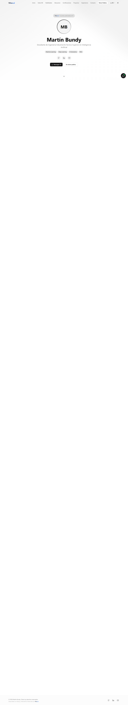

# Vitae.ai

AI-powered interactive CV and portfolio built with Next.js. Designed to help recruiters understand a candidate fast through smart insights, Q&A, and a polished visual narrative.

## Live Sites

- **Personal CV (Martin Bundy)**: https://portfolio-eitinchos-projects.vercel.app
- **Public Demo (Customizable Preview)**: https://vitae-demo.vercel.app

## Screenshots




## Two Modes (Do Not Mix)

### 1. Personal Mode (Your real CV)
- Uses real data from `src/data/cv-data.ts`
- Intended for recruiters and job applications
- Default build mode: `NEXT_PUBLIC_APP_MODE=personal`

### 2. Demo Mode (Public template)
- Uses sample data from `src/data/cv-data.example.ts`
- Includes `/demo` upload + 60% preview with watermark
- Build mode: `NEXT_PUBLIC_APP_MODE=demo`

> The demo is deployed as a **separate Vercel project**. Keep personal data out of the demo deployment.

---

## What This App Includes

**For recruiters**
- AI insights dashboard (profile strength, standout factors, ideal roles)
- Recruiter-oriented CV analysis and summaries
- Section Q&A (skills, projects, education, experience)
- Skill recommender based on the CV

**For candidates**
- Interactive CV layout
- 10-language localization
- Responsive design with modern visual structure
- Dark/light mode

---

## Tech Stack

- **Framework:** Next.js (App Router)
- **Language:** TypeScript
- **Styling:** Tailwind CSS + shadcn/ui
- **Animations:** Framer Motion
- **AI:** Groq + Vercel AI SDK
- **Hosting:** Vercel

---

## Quick Start

```bash
git clone https://github.com/EiTinchoZ/Portafolio-CV-Interactivo.git
cd Portafolio-CV-Interactivo
npm install
cp .env.example .env.local
```

Edit `.env.local` with your values:

```bash
GROQ_API_KEY=your_groq_api_key_here
NEXT_PUBLIC_GITHUB_USERNAME=your_github_username
NEXT_PUBLIC_APP_MODE=personal
NEXT_PUBLIC_DEMO_URL=https://your-demo.vercel.app
NEXT_PUBLIC_PERSONAL_URL=https://your-personal-cv.vercel.app
```

Create your CV file:

```bash
cp src/data/cv-data.example.ts src/data/cv-data.ts
```

Run locally:

```bash
npm run dev
```

---

## Deployment (Two Separate Projects)

### Personal CV (Production)
- Deploy with `NEXT_PUBLIC_APP_MODE=personal`
- Uses your real CV data

### Public Demo (Template)
- Deploy with `NEXT_PUBLIC_APP_MODE=demo`
- Uses example data + `/demo` uploader

> If you are using this repo as a public template, do **not** commit real CV data. Keep `src/data/cv-data.ts` private.

---

## CV Data Format

See `src/data/cv-schema.md` for the required structure and examples.

---

## Security

- Never commit API keys
- Use `.env.local` and Vercel Environment Variables
- Keep personal data out of public templates

---

## Contributing

Please read `CONTRIBUTING.md`. Contributions are welcome.

---

## License

MIT License. See `LICENSE`.

---

## Credits

- Martin Alejandro Bundy Munoz (Owner)
- Claude Code (AI collaborator)
- Codex (AI collaborator)
