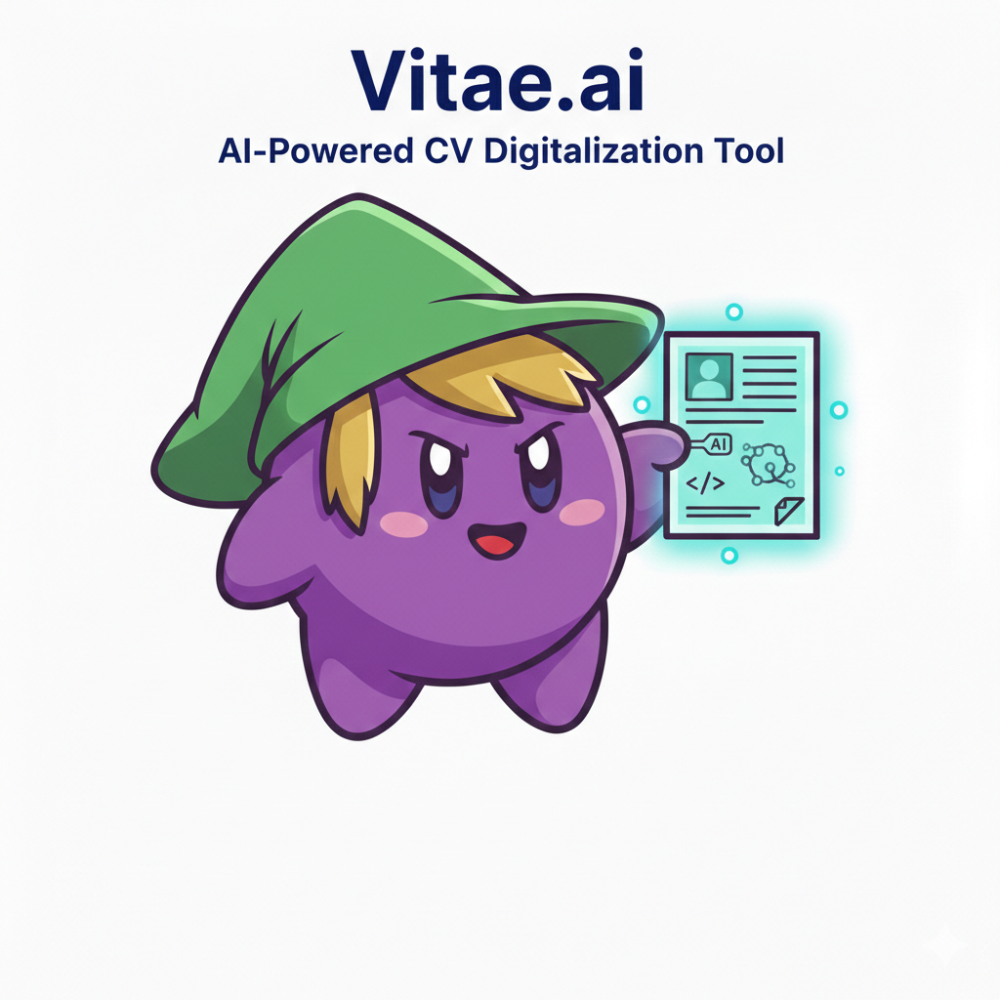

# Vitae.ai



Vitae.ai is an AI-powered, interactive CV platform that turns a traditional resume into a clean, visual, and structured digital profile. It helps students and professionals present their experience, education, and skills in a format that is easier to read, easier to update, and more memorable than a standard PDF.

[](https://github.com/EiTinchoZ/Vitae.ai)
[](https://nextjs.org/)
[](https://www.typescriptlang.org/)
[](https://tailwindcss.com/)
[](https://www.framer.com/motion/)
[](https://github.com/EiTinchoZ/Vitae.ai)
[](https://vercel.com/)
[](./LICENSE)

## Vision

Most people still manage their CVs in scattered formats and update them manually. Vitae.ai provides a single structured source of truth with an elegant, modern presentation so your professional story is always current and easy to share.

This project was created by a university student with the goal of helping young professionals and students stand out with a more modern and compelling CV experience.

## Origin

Vitae.ai started as a personal CV project. The goal was to build a portfolio that felt modern and genuinely useful for real-world job applications. As the project grew, it became a template that other students and professionals could reuse to build their own digital CVs without losing the structure and design quality of the original.

## What It Includes

- Interactive CV layout with modern UI
- AI insights, section Q&A, and CV analysis
- Multi-language support (10 languages)
- Dark and light themes
- Public demo with full preview and watermark
- Two deployment modes (personal and demo)

## Live Previews

- Personal CV example: [View the live CV](https://portfolio-eitinchos-projects.vercel.app)
- Public demo (watermarked preview): [Try the demo](https://vitae-demo.vercel.app)

The demo lets anyone test the experience with their own data. The watermark stays in place unless the project is installed locally.

## How The Demo Works

1. Upload or paste a CV
2. The app builds a full preview with your content
3. A watermark remains visible in demo mode
4. Remove the watermark by installing the project locally

## About Groq

Vitae.ai uses Groq to power the AI features (insights, Q&A, and CV analysis). Groq provides fast, production-grade inference for large language models. To use these features, you need a Groq API key.

How to get a Groq API key:

1. Create a Groq account
2. Open the Groq console
3. Generate a new API key
4. Copy the key into your environment variables

## Tech Stack

- Next.js 16 (App Router)
- TypeScript
- Tailwind CSS
- Framer Motion
- Groq AI
- Vercel (deployment)

## Getting Started

For a step-by-step guide (including a no-terminal path), read [INSTALL.md](./INSTALL.md).

### Option A: Simple Setup (No Terminal Required)

This path is for people who are not comfortable with command line tools.

1. Create a GitHub account.
2. Fork this repository to your account.
3. Create a Vercel project and import your fork.
4. Create a Groq API key.
5. Set the environment variables inside Vercel:
   - GROQ_API_KEY
   - NEXT_PUBLIC_GITHUB_USERNAME
   - NEXT_PUBLIC_APP_MODE (personal or demo)
   - NEXT_PUBLIC_DEMO_URL
   - NEXT_PUBLIC_PERSONAL_URL
6. Deploy.
7. Edit your CV data directly in GitHub by opening `src/data/cv-data.ts` and updating the values.

### Option B: Developer Setup (Fastest for technical users)

```bash
git clone https://github.com/EiTinchoZ/Vitae.ai.git
cd Vitae.ai
npm install
cp .env.example .env.local
cp src/data/cv-data.example.ts src/data/cv-data.ts
npm run dev
```

Then edit `src/data/cv-data.ts` and refresh your local site.

## Environment Variables

These variables control the AI features and deployment mode. Set them in Vercel or in `.env.local`.

| Variable | Required | Purpose |
| --- | --- | --- |
| GROQ_API_KEY | Yes | Enables AI features (insights, Q&A, CV analysis). |
| NEXT_PUBLIC_GITHUB_USERNAME | Yes | Shows your GitHub profile and repositories. |
| NEXT_PUBLIC_APP_MODE | Yes | `personal` shows your real CV; `demo` enables the public demo flow. |
| NEXT_PUBLIC_DEMO_URL | Recommended | Public demo URL used in navigation and CTA links. |
| NEXT_PUBLIC_PERSONAL_URL | Recommended | Personal CV URL used in navigation and CTA links. |

## Project Structure

- `src/app` - Next.js routes and layout
- `src/components` - UI sections, shared components, AI widgets
- `src/data` - CV data and schema
- `public` - static assets (images, certificates, CV PDF)

## Deployment Notes

Deploy two separate Vercel projects:

- Personal CV: `NEXT_PUBLIC_APP_MODE=personal`
- Public Demo: `NEXT_PUBLIC_APP_MODE=demo`

This keeps your real data isolated from the public demo.

## Privacy and Security

- Never commit API keys
- Keep real CV data out of public templates
- Use `.env.local` and Vercel environment variables

## License

This project uses a non-commercial license. See `LICENSE` for details.

## Credits

Created and maintained by Martín Alejandro Bundy Muñoz.
