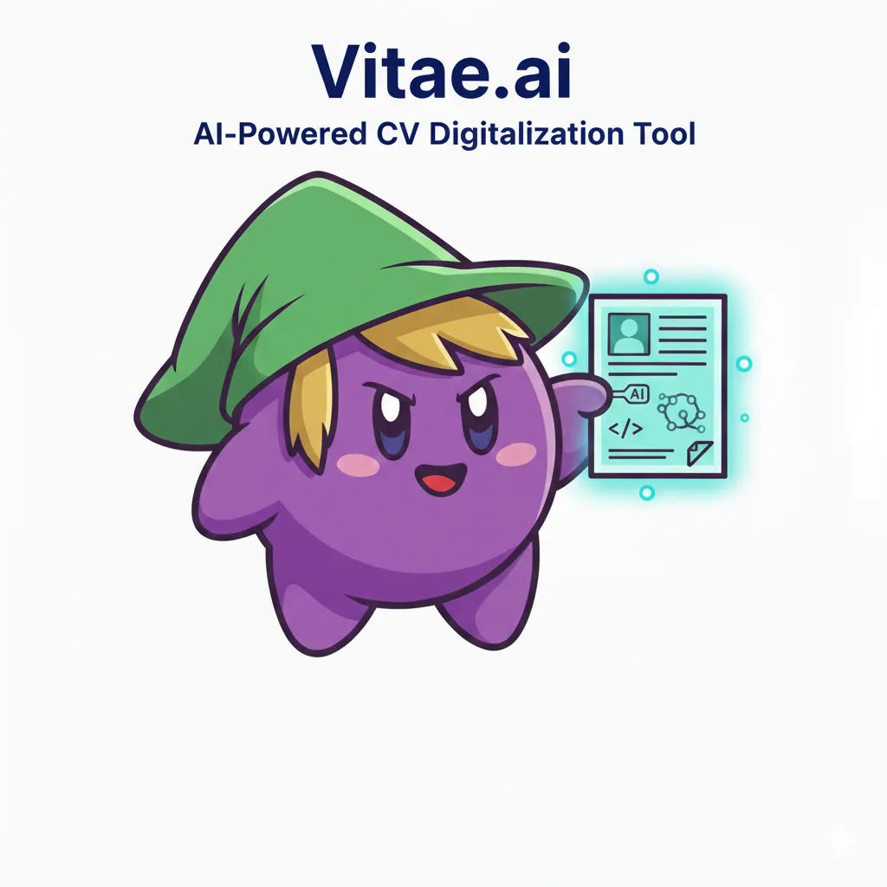

<p align="center">
  
</p>

<h1 align="center">Vitae.ai — AI-Powered Interactive CV</h1>

<p align="center">
  <em>"Traditional CVs tell you what someone did. This portfolio shows you who I am."</em>
</p>

<p align="center">
  <a href="https://vitae.lat"><strong>🌐 Live Demo → vitae.lat</strong></a>
</p>

<p align="center">
  
  
  
  
  
</p>

---

## What is Vitae.ai?

Vitae.ai is a **digital CV / interactive portfolio** with a built-in AI assistant.
Instead of handing a recruiter a boring PDF, you give them a full web experience where they can
**chat with an AI** that knows everything about you.

### What can a recruiter do here?

- Read your profile, skills, education, experience, and projects — all beautifully animated
- **Ask the AI chatbot** questions like *"What projects has Martin worked on?"* or *"Does he speak English?"*
- Download the PDF CV in one click
- Switch between **10 languages** (ES, EN, DE, FR, PT, JA, ZH, KO, AR, HI)

### How is this different from a regular portfolio?

| Regular portfolio | Vitae.ai |
|---|---|
| Static HTML page | Interactive, animated, cinematic |
| Recruiter reads passively | Recruiter can ask questions to an AI |
| One language | 10 languages, with switcher in navbar |
| Generic Tailwind design | Custom "Nura-style" design system |
| No AI | AI chatbot powered by Llama 3.1 via Groq |

---

## Tech Stack — explained for everyone

You don't need to be a developer to understand this. Here's what each piece does:

| Technology | What it does | Why I chose it |
|---|---|---|
| **Next.js 16** | The framework that builds the whole site | Industry standard, excellent performance |
| **React 19** | Builds all the visual components (buttons, cards, sections) | Latest version, powers most of the web |
| **TypeScript** | JavaScript with type safety — catches bugs early | Required for production-quality code |
| **Tailwind CSS v4** | Utility classes for styling (`rounded-xl`, `text-sm`…) | Fast, no separate CSS files to manage |
| **Framer Motion** | Smooth entry animations for components | Best animation library for React |
| **GSAP + ScrollTrigger** | Advanced scroll animations (Hero, Manifesto, Experience) | Handles complex timelines Framer Motion can't |
| **Groq API** | Runs the AI inference (the chatbot's brain) | **Free tier**, much faster than OpenAI |
| **Llama 3.1 70B** | The AI language model powering the chatbot | Open-source, high quality, free via Groq |

### Design System — "Cinematic Nura-style"

The visual identity is inspired by editorial and premium health-tech aesthetics.
Everything is intentional: organic backgrounds, dramatic typography contrast, warm palette.

```
Color palette (oklch color space):
  Moss    (Primary): oklch(0.282 0.038 152) = #2E4036  ← dark forest green
  Clay    (Accent):  oklch(0.565 0.158 37)  = #CC5833  ← warm terracotta
  Cream   (BG):      oklch(0.962 0.007 83)  = #F2F0E9  ← warm off-white
  Charcoal (Text):   oklch(0.127 0 0)       = #1A1A1A  ← near black

Typography:
  Headlines  → Plus Jakarta Sans (bold, geometric, modern)
  Big quotes → Cormorant Garamond (italic, editorial, elegant)
  Code/data  → Geist Mono (monospace, technical, clean)
```

---

## Project Structure

```
portfolio/
├── src/
│   ├── app/
│   │   ├── api/
│   │   │   ├── chat/          ← AI chatbot endpoint (connects to Groq)
│   │   │   └── contact/       ← Contact form handler
│   │   ├── page.tsx           ← Main page — assembles all 9 sections in order
│   │   └── globals.css        ← Global styles and CSS custom properties
│   │
│   ├── components/
│   │   ├── sections/          ← The 9 portfolio sections (one file each)
│   │   │   ├── Hero.tsx           ← Full-screen hero with GSAP animations
│   │   │   ├── About.tsx          ← Bio, highlights, profile photo
│   │   │   ├── Skills.tsx         ← 4 interactive artifact cards
│   │   │   ├── Education.tsx      ← Academic timeline with progress bars
│   │   │   ├── Certificates.tsx   ← Certifications with PDF viewer
│   │   │   ├── Projects.tsx       ← Featured project + live GitHub repos
│   │   │   ├── ManifestoSection.tsx ← Animated editorial statement
│   │   │   ├── Experience.tsx     ← Work experience, GSAP stacking cards
│   │   │   └── Contact.tsx        ← Form + social links
│   │   ├── chat/              ← AI chatbot floating widget
│   │   ├── ai/                ← AI-powered section Q&A components
│   │   ├── shared/            ← Navbar, Footer, SectionWrapper
│   │   └── ui/                ← Base primitives (Button, Card…)
│   │
│   ├── data/
│   │   └── cv-data.ts         ← ⭐ ALL personal CV content lives here
│   │
│   ├── i18n/
│   │   └── locales/           ← One JSON file per language
│   │       ├── es.json        ← Spanish (default)
│   │       ├── en.json
│   │       ├── de.json
│   │       ├── fr.json
│   │       ├── pt.json
│   │       ├── ja.json
│   │       ├── zh.json
│   │       ├── ko.json
│   │       ├── ar.json
│   │       └── hi.json
│   │
│   └── lib/                   ← Utility functions, hooks, config
│
├── public/
│   ├── hero-forest.jpeg       ← Hero background image
│   ├── martin-profile.webp    ← Profile photo
│   ├── cv/                    ← Downloadable PDF CV
│   │   └── CV_Martin_Bundy_2026.pdf
│   └── images/                ← Background images for sections
│
├── .env.local                 ← 🔒 API keys — NOT in git, never shared
├── .env.example               ← Template showing which keys are needed
└── README.md                  ← You are here
```

---

## How to Run It Locally (Step by Step)

### What you need first

- **Node.js 18 or higher** → download at [nodejs.org](https://nodejs.org)
- **A code editor** → [VS Code](https://code.visualstudio.com) (free, recommended)
- **A Groq API key** (free) → [console.groq.com](https://console.groq.com)

### Step 1 — Get the code

```bash
git clone https://github.com/EiTinchoZ/Vitae.ai.git
cd Vitae.ai
```

### Step 2 — Install dependencies

```bash
npm install
```

This downloads all the libraries the project needs. Takes 1–2 minutes. Normal.

### Step 3 — Create your `.env.local` file

In the project root, create a new file called `.env.local` and add:

```env
GROQ_API_KEY=gsk_xxxxxxxxxxxxxxxxxxxxxxxx
```

**How to get your Groq API key (free):**
1. Go to [console.groq.com](https://console.groq.com)
2. Sign up with Google or email
3. Click **"API Keys"** in the left menu → **"Create API Key"**
4. Copy the key and paste it in `.env.local`

### Step 4 — Start the dev server

```bash
npm run dev
```

Open [http://localhost:3000](http://localhost:3000) in your browser. Done! 🎉

### Useful commands

```bash
npm run dev     # Start development server (with live reload)
npm run build   # Build for production and check for errors
npm run start   # Run the production build locally
npm run lint    # Check code quality
```

---

## How to Make It Your Own

### 1. Change your personal data

Everything about the person (name, email, skills, experience, education, projects…)
lives in a single file:

```
src/data/cv-data.ts
```

Open it, find your info, change the values. The whole site updates automatically.

### 2. Replace images

Put your own photos in the `public/` folder and update the file names in the code.

### 3. Change the AI chatbot's knowledge

The chatbot knows about you through a **system prompt** in:

```
src/app/api/chat/route.ts
```

Edit that text to describe yourself, your skills, and how you want the AI to respond.

### 4. Add or remove sections

The page order is set in `src/app/page.tsx`. Comment out (`// <SectionName />`)
any section you don't want to show.

### 5. Change languages

Edit the JSON files in `src/i18n/locales/` to change any text label, or add a new language
by copying `en.json`, translating it, and adding it to the language switcher.

---

## Deploy to the Internet (Free)

The easiest way is **[Vercel](https://vercel.com)** — the same company that makes Next.js:

1. Push your fork to GitHub
2. Go to [vercel.com](https://vercel.com) → **"New Project"** → import your GitHub repo
3. In the **"Environment Variables"** section, add:
   - `GROQ_API_KEY` = your Groq key
4. Click **"Deploy"** → Vercel builds and publishes it automatically

Your site will be live at `your-project-name.vercel.app` in about 60 seconds.
You can then connect a custom domain (like `vitae.lat`) for free.

---

## Feature List

| Feature | Description |
|---|---|
| 🤖 **AI Chatbot** | Ask anything about the candidate — powered by Llama 3.1 70B |
| 🌍 **10 Languages** | Auto-detects browser language, manual switcher in navbar |
| 🎬 **Cinematic animations** | GSAP word-split reveals, parallax, sticky scroll stacking |
| 📄 **PDF Download** | One-click CV download |
| 🐙 **GitHub integration** | Live repo data pulled from GitHub API |
| 📬 **Contact form** | Direct message, no third-party service needed |
| 🏆 **Certificate viewer** | PDF preview + download per certification |
| 🔒 **Demo mode** | Public demo at `/demo` with sanitized data |
| ♿ **Accessible** | WCAG-compliant labels, keyboard navigation, reduced-motion support |
| 📱 **Mobile-first** | Fully responsive, all screen sizes |
| ✨ **Mixed aesthetic** | Light and dark sections for visual rhythm |

---

## The Idea Behind This

A CV is a first impression. Recruiters spend an average of **6 seconds** on a resume.

Vitae.ai was built around one question: *what if a CV could have a conversation?*

Instead of listing bullet points, it gives recruiters a reason to **stay, explore, and ask**.
The AI chatbot turns a static document into an active dialogue.
The cinematic design makes it memorable.

This is my take on what a modern professional identity can look like in 2026.

---

## Author

**Martin Bundy** — Industrial Engineering student + AI Technician

- 🌐 [vitae.lat](https://vitae.lat)
- 💻 [github.com/EiTinchoZ](https://github.com/EiTinchoZ)
- 💼 [linkedin.com/in/martin-bundy](https://www.linkedin.com/in/martin-bundy)

---

## License

Open source — MIT. Fork it, customize it, build your own.
If you do, a ⭐ star on the repo is appreciated!

---

<p align="center">
  Built with ♥ in Panama &nbsp;·&nbsp; Next.js + Groq + Llama 3.1 &nbsp;·&nbsp; 2026
</p>
